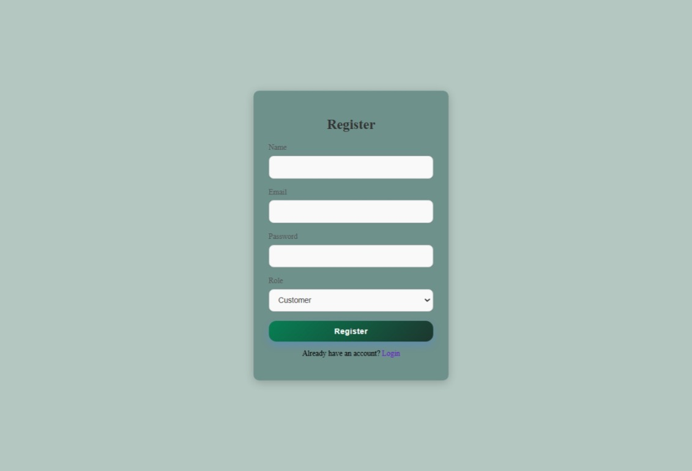
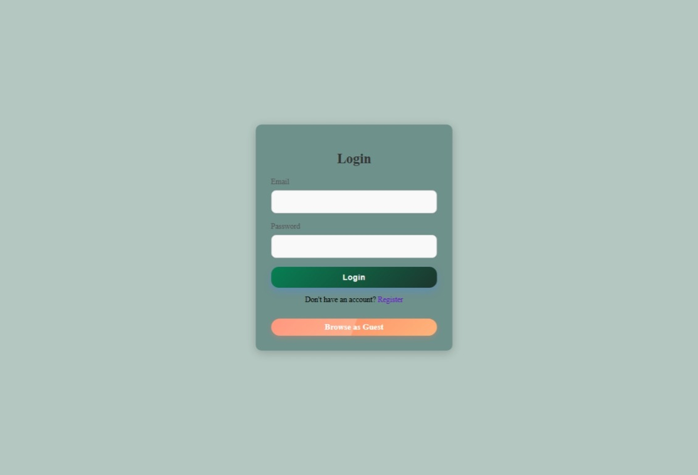
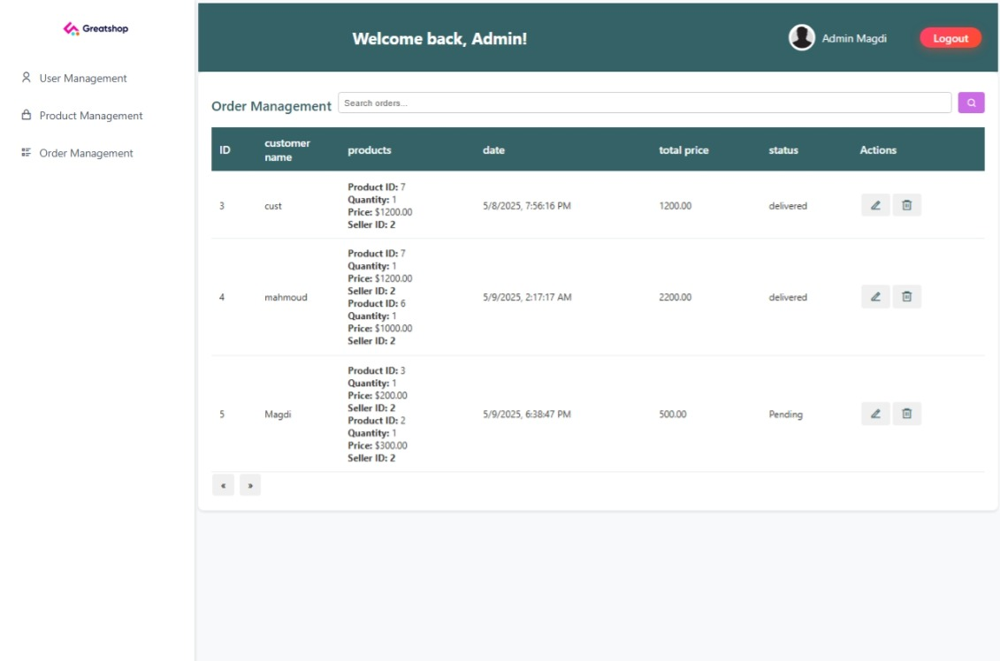

# E-Commerce Platform

## Overview

This project is a fully functional e-commerce platform built using modern web development technologies. It provides users with a seamless shopping experience, including product browsing, cart management, and secure checkout.

## Features

- **User Authentication**: Sign up, log in, and manage user accounts.
- **Product Management**: Browse, search, and filter products.
- **Shopping Cart**: Add, update, and remove items from the cart.
- **Order Management**: Place orders and view order history.
- **Responsive Design**: Optimized for both desktop and mobile devices.

## Technologies Used

- **Frontend**: HTML, CSS, JavaScript
- **Database**: MongoDB
- **Version Control**: Git

## Installation

1. Clone the repository:
   ```bash
   git clone https://github.com/your-username/e-commerce-platform.git
   ```
2. Navigate to the project directory:
   ```bash
   cd e-commerce-platform
   ```
3. Install dependencies:
   ```bash
   npm install
   ```
4. Start the development server:
   ```bash
   npm start
   ```

## Usage

- Open the application in your browser at `http://localhost:3000`.
- Register or log in to access all features.
- Browse products, add them to your cart, and proceed to checkout.

## Contact

contact us @ [mahmoudemad7521@gmail.com] & [mahmoud.h.mosaad@gmail.com].

## Screen Shots




